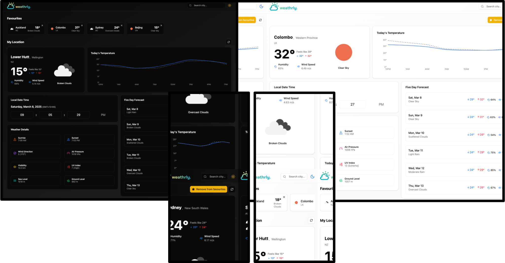

## <a name="table">Table of Contents</a>

1. 📝 [Introduction](#introduction)
2. 🛠️ [Tech Stack](#tech-stack)
3. 🔮 [Features](#features)
5. 🚀 [Quick Start](#quick-start)

## <a name="introduction">📝 Introduction</a>

Weathrly is a weather application built with **React**, **TypeScript**, and **Vite** that provides users with detailed weather data using the [OpenWeatherMap API](https://openweathermap.org/api). With Weathrly, users can access real-time weather information, hourly forecasts, and a 5-day outlook for any city. The app also allows users to search for cities, view their local weather, and manage a list of favorite cities 🌟.

React Query is used in Weathrly to handle data fetching from the OpenWeatherMap API. It helps manage cache, retries, background data synchronisation, and loading states, providing a smooth and optimised user experience when interacting with weather data.

The application has been deployed to production and is now live! 🎉 You can access it at [weather-app-six-black-74.vercel.app](https://weather-app-six-black-74.vercel.app).



## <a name="tech-stack">🛠️ Tech Stack</a>

- **Vite** – A fast and optimised build tool that enhances development speed with instant hot module replacement (HMR).
- **TypeScript** – A statically typed superset of JavaScript that improves code quality and maintainability.
- **React.js** – A JavaScript library for building user interfaces with reusable components and efficient rendering.
- **TailwindCSS** – A utility-first CSS framework that enables rapid, responsive, and customisable designs.
- **ShadCN** – A component library for building modern, reusable UI components.
- **Recharts** - A React-based charting library used to visualise data with interactive and customisable charts.
- **OpenWeatherMap API** - Provides real-time weather data and forecasts for cities, including geolocation support.
- **@tanstack/react-query** – A data fetching and caching library for React that helps with efficient handling of asynchronous data, improving performance and user experience.

## <a name="features">🔮 Features</a>

### Index Page
The main dashboard that provides an overview of the weather, including the current temperature, hourly temperature comparison (with a line chart), weather conditions, and a 5-day forecast for the user's current location. It also displays additional weather details such as sunrise, sunset, wind speed, air pressure, visibility, UV index, and more.

### City Page
When users select a city from the search results, they are taken to the city-specific page, which displays detailed weather information for that location. This includes the current temperature, hourly temperature data, weather conditions, and a 5-day forecast, along with the option to add or remove the city from the list of favourites.

### Search
Users can search for cities to view current weather conditions. The search feature includes suggestions as the user types, a list of recent searches, and a list of favourite cities, enabling quick access to frequently checked locations.

### Refresh Button
Both the index and city pages include a refresh button that allows users to fetch the most up-to-date weather data from the OpenWeatherMap API, ensuring that users always have the latest weather information.


### Light/Dark Mode
Weathrly allows users to switch between light and dark modes for an enhanced user experience, allowing them to choose a theme that suits their preferences and improves readability.

## <a name="quick-start">🚀 Quick Start</a>

To get the project up and running locally on your machine, follow the steps below:

**Prerequisites**

Make sure the following dependencies are installed on your system:

- [Git](https://git-scm.com/)
- [Node.js](https://nodejs.org/en)
- [npm](https://www.npmjs.com/) (Node Package Manager)

**Cloning the Repository**

Clone the repository and navigate into the project directory:

```bash
git clone https://github.com/rosie-roses/weather-app.git
cd weather-app
```

**Installation**

Install the required project dependencies:

```bash
npm install
```

**Set Up Environment Variables**

1. Create a ```.env``` file in the root directory using the ```.env.example``` file as a template.
2. Inside the ```.env``` file, populate the variable ```VITE_OPENWEATHERMAP_API_KEY``` with your OpenWeatherMap API key.
3. To obtain an API key, follow these steps:
    - Go to the [OpenWeatherMap](https://openweathermap.org/) website.
    - Sign up or log in to your account.
    - Navigate to the **API Keys** section in your account dashboard.
    - Copy your API key.

Paste the API key into your .env file as follows:
```bash
VITE_OPENWEATHERMAP_API_KEY=your-api-key-here
```

**Run the Application Locally**

Once your environment variables are set up, you can run the development server:

```bash
npm run dev
```

This will start the app at [http://localhost:5173](http://localhost:5173). Open this URL in your browser to start using the Weathrly app locally  💖